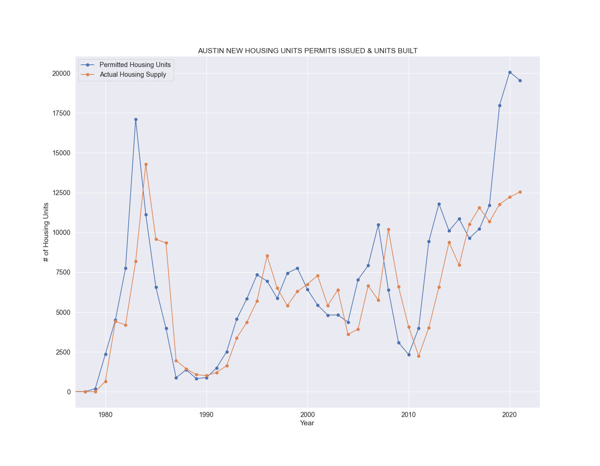

# charting_the_boom

This repository is a python script that connects to the city of Austin's public, open-source data API and downloads and compiles data to produce a up-to-date chart showing the amount of new housing supply vs demand in PNG format. This script takes advantage of the Socrata API's ability to use simple SQL-like queries in the request to greatly expedite the process, as well as make the downloaded data significantly easier to handle than working with the entire 1.5GB data set. This script was built to go along with my [Austin Housing](https://nathaniel-j.github.io/Austin-Building-Boom/) project, so that I could automate the process of tracking my predictions made in that project. The chart below was produced by this code on 12/21/2021 (winter solstice!).

The original intent for this project was to build this as an AWS Lambda script to be run in the cloud as an automated process and have the chart saved in an AWS S3 bucket to be statically hosted, however, the libraries I used made the script file too large to be held or used with Lamba. I might see if I can pare the dependecies down to make it fit under Lambda's 50MB threshold, but for now I am going to run this script locally on a weekly basis to update the chart in my S3 bucket and work on getting that chart set up to be public facing. 
